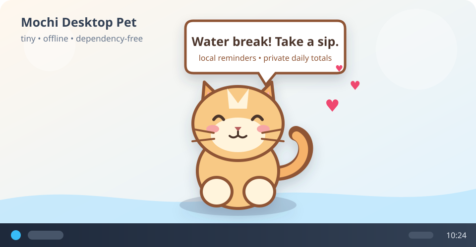

# Mochi Desktop Pet

[](https://github.com/m18023318493-sys/mochi-desktop-pet/actions/workflows/ci.yml)
[](https://www.python.org/)
[](LICENSE)

A tiny customizable companion that lives on your desktop. Keep the built-in animated cat or import a full-body image that walks around with automatic left/right facing and a gentle step motion. Mochi works offline after installation, nudges you to drink water, and can optionally show daily aggregate active/idle time on Windows.



## Features

- Transparent, borderless, always-on-top window on Windows
- Gentle idle animation, blinking, tail swishes, and automatic wandering
- Import a PNG, JPEG, WebP, GIF, or BMP as the desktop character
- Automatic left/right mirroring, walking bob, and four image-size options
- Switch back to Mochi without deleting the saved custom image
- Drag Mochi anywhere; position and preferences are remembered
- Double-click for hearts and a happy message
- Hydration reminders every 30, 45, 60, 90, or 120 minutes (60 by default)
- Quiet hydration hours from 22:00 through 08:00
- Optional Windows activity totals and a daily water counter
- Right-click menu to view today's summary, pause features, reset, or quit
- Handles multi-monitor desktop bounds on Windows
- Custom images stay local and are re-encoded without EXIF metadata
- No telemetry, ads, or data uploads

## Quick start

Requires Python 3.10 or newer with Tkinter (included in the standard Windows installer) and Pillow for safe image import.

For the easiest Windows setup, download `mochi-desktop-pet-v0.3.0.zip` from the [latest release](https://github.com/m18023318493-sys/mochi-desktop-pet/releases/latest), extract the whole ZIP, then double-click `start_mochi.bat`. On first launch, the script installs Pillow if it is not already available; this one-time dependency install needs internet access. Mochi itself does not use the network.

Or run it from source:

```powershell
git clone https://github.com/m18023318493-sys/mochi-desktop-pet.git
cd mochi-desktop-pet
python -m pip install .
python mochi_pet.py
```

On Windows, you can also double-click `start_mochi.bat` after cloning the repository.

### Optional command installation

```powershell
python -m pip install .
mochi-pet
```

## Controls

| Action | Result |
| --- | --- |
| Drag with the left mouse button | Move Mochi |
| Double-click | Pet Mochi and show hearts |
| Right-click | Change appearance, log water, view totals, configure reminders, or quit |
| <kbd>Esc</kbd> | Quit while Mochi has keyboard focus |

Launch without automatic wandering:

```powershell
python mochi_pet.py --no-wander
```

Reset the saved position and preferences:

```powershell
python mochi_pet.py --reset-settings
```

Enable local aggregate activity statistics from the command line:

```powershell
python mochi_pet.py --enable-activity
```

Delete preferences, activity/water history, and the processed custom image before starting:

```powershell
python mochi_pet.py --reset-all-data
```

## Custom appearance

Right-click Mochi and choose **Appearance → Choose custom image...**. The selected image is normalized once, stripped of metadata, and copied to Mochi's local data folder as `custom_avatar.png`; the original file is never changed and its path is not retained. Mochi caches left- and right-facing frames, so it does not reopen the photo during every animation frame.

A transparent, tightly cropped full-body PNG gives the best result. JPEG and other opaque images work, but their rectangular background remains visible. Animated GIFs use the first frame. A single photo can move, mirror, and bob, but it cannot produce true leg-by-leg walking; that would require a future multi-frame sprite feature.

Use **Appearance → Use Mochi** to switch back without deleting the custom image, **Use saved custom image** to switch again, or **Remove saved custom image...** to delete Mochi's processed local copy.

## 简体中文

Mochi 是一个轻量桌面宠物。左键拖动，双击互动；右键可以导入人物全身图作为新形象、调整大小、恢复默认麻薯，也可以记录喝水、查看今日汇总及控制活跃度统计。

Windows 用户安装 Python 3.10+ 后，可以从 [Releases](https://github.com/m18023318493-sys/mochi-desktop-pet/releases/latest) 下载 ZIP，先完整解压，再双击 `start_mochi.bat` 启动。首次启动会在缺少时安装 Pillow 图像库；之后程序本身可离线运行。

喝水提醒默认开启，每运行 60 分钟提醒一次，22:00–08:00 静默。活跃/空闲统计默认关闭；只有你主动开启后才会在 Windows 上读取“距离上次本机输入经过了多久”这一数值，并仅保存每天的汇总秒数。

透明背景、裁剪紧凑的全身 PNG 效果最好。导入图片会去除 EXIF 等元数据，并只把处理后的副本保存在本机，不上传。单张照片会左右翻转和轻微起伏，但不会产生真实的逐帧腿部动作。

## Privacy and local data

Mochi works offline after its dependencies are installed and never sends custom images, reminder data, or activity data over the network. Activity statistics are **off by default**. When enabled on Windows, Mochi asks the operating system once per second only for the elapsed time since the last local input. It does not install keyboard or mouse hooks and never logs or stores keystrokes, typed text, pointer trails, clipboard contents, application/process names, window titles, browser history, or screenshots. Dragging uses the current pointer position only to move the pet and does not record it.

Hydration reminders are on by default. With activity statistics off, their timer advances while Mochi is running. With activity statistics on, idle time pauses that timer. An ignored reminder is shown again after 10 active minutes; logging water resets the selected interval. Reminders are a general wellbeing aid, not medical advice.

Mochi stores no raw event sequence. It retains at most 30 daily aggregate records in these local files:

- Windows: `%APPDATA%\MochiDesktopPet\settings.json`, `activity.json`, and optional `custom_avatar.png`
- macOS/Linux: `~/.config/MochiDesktopPet/settings.json`, `activity.json`, and optional `custom_avatar.png`
- `settings.json`: window position, appearance choice, feature toggles, idle threshold, and reminder interval
- `activity.json`: date, aggregate active/idle seconds, water count, and aggregate reminder/snooze seconds
- `custom_avatar.png`: a bounded, metadata-free copy created only after you select an image

Statistics are collected only while Mochi is running. Long sleep/resume gaps are capped instead of being counted as hours of activity, and a new local-date bucket is created after midnight. Use **Delete activity history...** to clear aggregates, **Remove saved custom image...** to delete the processed image, or `--reset-all-data` to delete all three local data files before launch.

To uninstall, delete the cloned project (or run `python -m pip uninstall mochi-desktop-pet` if installed) and optionally delete the `MochiDesktopPet` settings folder.

## Compatibility

Windows 10/11 is the primary target and the only platform with active/idle statistics. macOS and Linux can run the pet and hydration timer, but transparent-window behavior depends on the desktop environment. Per-monitor scaling may make the pet appear slightly different on mixed-DPI setups.

## Development

```powershell
python -m unittest discover -s tests -v
python -m py_compile activity_core.py avatar_core.py pet_core.py mochi_pet.py
```

See [CONTRIBUTING.md](CONTRIBUTING.md) for contribution guidance and [SECURITY.md](SECURITY.md) for private vulnerability reporting guidance.

## License

MIT. The built-in cat artwork is made from Canvas primitives in this repository and is covered by the same license. You are responsible for having permission to use any custom image you import; imported images are not added to the repository or relicensed.
